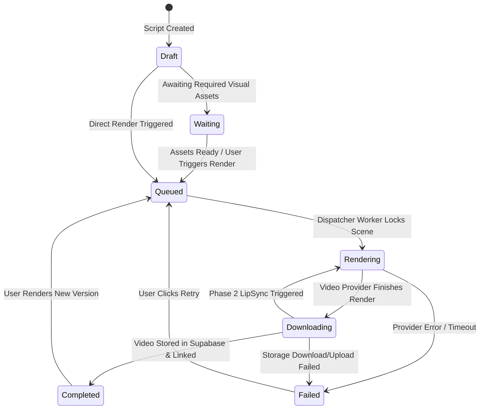
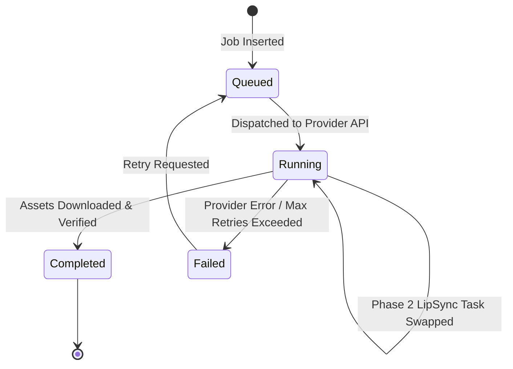
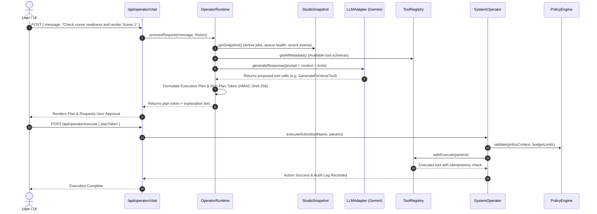

# SYSTEM ARCHITECTURE: AI STUDIO & WORKFORCE PLATFORM
**Project Codename:** Gideon AI HQ / The Basement  
**Subsystem:** Content Production Department (AI Studio)  
**Date:** September 2026  
**Reference ID:** `ARCH-SPEC-002`

---

## 1. High-Level System Architecture

The system is structured as a **Modular Distributed Next.js / Supabase Architecture**, designed to separate user-facing reactive interfaces from background AI orchestration, deterministic state machines, and external AI provider APIs.

```mermaid
graph TD
    subgraph Client [Browser Client / UI]
        CC[Command Center]
        EP[Episodes / Kanban]
        SC[Scenes Workspace]
        AL[Asset Library]
        OP[Operations / Queue / Jobs]
        BP[BackgroundPoller (10s)]
    end

    subgraph APILayer [Next.js App Router API Handlers]
        API_Dash[/api/dashboard]
        API_Scenes[/api/scenes/*]
        API_Assets[/api/assets/*]
        API_Jobs[/api/jobs/*]
        API_Cron[/api/cron/workers]
        API_Operator[/api/operator/*]
    end

    subgraph DomainServices [Domain Services & State Machines]
        GSS[GenerateScriptService]
        AS[AssetService]
        JS[JobService]
        PS[ProviderService]
        SM_Scene[SceneStateMachine]
        SM_Job[JobStateMachine]
    end

    subgraph OperatorRuntime [AI Operator Runtime]
        OR[OperatorRuntime]
        TR[ToolRegistry]
        PE[PolicyEngine]
        CE[ContextEngine]
    end

    subgraph Workers [Background Queue Workers]
        WD[Dispatcher Worker]
        WP[Polling Worker]
        WDL[Download Worker]
    end

    subgraph StorageAndDB [Data & Storage Layer]
        PG[(Supabase PostgreSQL)]
        SB_Storage[Supabase Storage: studio-assets]
        GDrive[Google Drive API v3]
    end

    subgraph ExternalAI [External AI Providers]
        Gemini[Google Gemini 2.0 / GenAI SDK]
        PixVerse[PixVerse Video API v2]
        ElevenLabs[ElevenLabs TTS API]
        Veo[Google Vertex Veo 3]
    end

    CC --> API_Dash
    SC --> API_Scenes
    AL --> API_Assets
    OP --> API_Jobs
    BP --> API_Cron

    API_Dash --> DomainServices
    API_Scenes --> DomainServices
    API_Assets --> AS
    API_Jobs --> JS
    API_Cron --> Workers
    API_Operator --> OR

    DomainServices --> PG
    GSS --> Gemini
    AS --> SB_Storage
    AS --> GDrive

    OR --> TR
    TR --> PE
    TR --> CE
    OR --> Gemini

    WD --> PixVerse
    WP --> PixVerse
    WDL --> PixVerse
    WDL --> SB_Storage
    WDL --> ElevenLabs

    Workers --> PG
```

---

## 2. Component & Directory Hierarchy

| Layer | Primary Files / Modules | Responsibility |
|---|---|---|
| **Presentation (Pages)** | `src/app/(dashboard)/**/page.tsx` | Next.js 15 client/server components rendering interactive dashboards, modals, and telemetry grids. |
| **Presentation (Components)** | `src/components/*` | Reusable modals (AssetUpload, AssetLink, SceneEdit, GenerationConfirm, AudioConfig, PreviewSync) and layout navigation. |
| **API Endpoints** | `src/app/api/**/route.ts` | 29 Next.js Route Handlers enforcing request validation, calling Domain Services, and returning JSON. |
| **Domain Services** | `src/lib/services/*` | Pure business logic (`GenerateScriptService`, `AssetService`, `JobService`, `EpisodeService`, `ProviderService`). |
| **State Machines** | `src/lib/state/machines/*` | Strict, deterministic transitions for `Project`, `Episode`, `Scene`, and `Job` entities. |
| **Data Repositories** | `src/lib/data/*` | Abstracted Data Source layer interfacing with Supabase tables. |
| **Render Providers** | `src/lib/providers/render/*` | Provider implementations (`PixVerseProvider`, `VeoProvider`, `MockProvider`) coordinated by `RenderManager`. |
| **Script Providers** | `src/lib/providers/script/*` | Prompt templates (`prompts.ts`), JSON Schema (`schema.ts`), and Gemini integration (`gemini.ts`). |
| **Voice Providers** | `src/lib/providers/voice/*` | ElevenLabs text-to-speech engine with prompt sanitizer (`ElevenLabsProvider.ts`). |
| **Storage Layer** | `src/lib/storage/*` | Unified storage abstraction (`StorageManager`) managing Supabase Buckets and Google Drive directories. |
| **Background Workers** | `src/lib/workers/index.ts` | 3-stage worker pipeline (`runDispatcherWorker`, `runPollingWorker`, `runDownloadWorker`). |
| **Operator Runtime** | `src/lib/operator/*` | Tool registry, policy engine, context engine, incident management, and replay-protected tool execution. |

---

## 3. State Machine Lifecycles

### Scene State Machine Lifecycle



### Job State Machine Lifecycle



---

## 4. 3-Stage Background Worker Pipeline

The rendering lifecycle is divided into three isolated, idempotent background workers executed concurrently via `Promise.allSettled` in `/api/cron/workers`:

```
┌─────────────────────────────────────────────────────────────────────────┐
│                       3-STAGE WORKER EXECUTION                          │
├─────────────────────────────────────────────────────────────────────────┤
│                                                                         │
│  [ Stage 1: DISPATCHER WORKER ]                                         │
│  1. Query 1 scene WHERE status = 'Queued'                               │
│  2. Optimistic lock: UPDATE scenes SET status = 'Rendering'             │
│  3. Submit to RenderManager (PixVerse / Veo)                           │
│  4. Insert row into `jobs` table with status = 'Running'                │
│                                                                         │
│                                  │                                      │
│                                  ▼                                      │
│  [ Stage 2: POLLING WORKER ]                                            │
│  1. Query all jobs WHERE status = 'Running'                             │
│  2. Fetch provider task status (GET /openapi/v2/video/result/{taskId})  │
│  3. If status == 'Completed' with valid video_url:                      │
│     - UPDATE scenes SET status = 'Downloading', video_url = url         │
│  4. If status == 'Failed':                                              │
│     - UPDATE jobs SET status = 'Failed'                                 │
│     - UPDATE scenes SET status = 'Failed'                               │
│                                                                         │
│                                  │                                      │
│                                  ▼                                      │
│  [ Stage 3: DOWNLOAD & STORAGE WORKER ]                                 │
│  1. Query 1 scene WHERE status = 'Downloading'                          │
│  2. Optimistic lock: UPDATE scenes SET status = 'Rendering'             │
│  3. Download MP4 binary from provider CDN (with retry backoff)          │
│  4. Upload MP4 buffer to Supabase Storage:                              │
│     `projects/{pId}/episodes/{eId}/scenes/{sId}/video/{assetId}-v1.mp4` │
│  5. Insert record into `assets` table and link in `scene_assets`        │
│  6. Audio Check: If LipSync enabled & voiceover exists:                 │
│     - Upload audio to PixVerse & submit lip-sync task                   │
│     - Re-queue job in 'Running' with new task ID                        │
│  7. If Phase 1 complete (or no lip-sync):                               │
│     - UPDATE jobs SET status = 'Completed'                              │
│     - UPDATE scenes SET status = 'Completed'                            │
│                                                                         │
└─────────────────────────────────────────────────────────────────────────┘
```

---

## 5. Operator Runtime & AI Agent Architecture

The codebase contains an early-stage production operator engine in `src/lib/operator/`:



### Key Architectural Strengths of the Operator Engine:
1. **Tool Registry (`ToolRegistry.ts`)**: Base abstract class requiring input/output schemas, cost estimation, timeout limits, dry-run simulations, and rollback handlers.
2. **Replay Protection / Idempotency**: Plan tokens are HMAC-signed and checked against `operator_executed_plans` in the database.
3. **Policy Engine (`PolicyEngine.ts`)**: Restricts tool execution based on user roles, budget constraints, and provider health.
