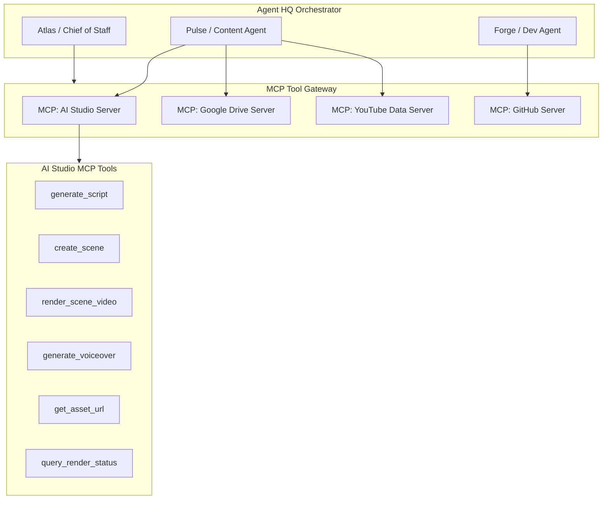

# INTEGRATION AUDIT: AI PROVIDERS, APIS & MCP MAPPING
**Project Codename:** Gideon AI HQ / The Basement  
**Subsystem:** Integration Gateway & External Providers  
**Date:** September 2026  
**Reference ID:** `INT-AUDIT-004`

---

## 1. Google Gemini AI Integration

### Implementation Locations:
- `src/lib/providers/script/gemini.ts` (`GeminiScriptProvider`)
- `src/lib/operator/adapters/LLMAdapter.ts` (`GeminiAdapter`)
- `src/lib/providers/script/prompts.ts` (`scriptGeneration_v1`)
- `src/lib/providers/script/schema.ts` (`ScriptSchema`)

### SDK & Connection Details:
- **SDK**: `@google/genai` (v2.13.0)
- **Configuration**:
  - API Key: `process.env.GEMINI_API_KEY` or `process.env.GOOGLE_API_KEY`
  - Model Default: `gemini-3.5-flash` with fallback to `gemini-3.5-flash-lite` in error handler
  - Response Mode: `responseMimeType: "application/json"` with Zod schema parsing
  - Temperature: `0.7`

### Audit Findings & Recommendations:
1. **Model Naming Compatibility**: The codebase references `gemini-3.5-flash` and `gemini-3.5-flash-lite` in `config.ts` and `gemini.ts`. In Google GenAI API, standard production models are `gemini-2.0-flash`, `gemini-1.5-flash`, `gemini-1.5-pro`, etc. If Google API rejects the model name, it triggers the fallback loop. We should standardize on `gemini-2.0-flash` (or user-configurable model in `config.ts`).
2. **Schema Reliability**: The script prompt enforces 15 scenes with duration 15s, image prompts with `--ar 16:9`, motion prompts, negative prompts, and character/environment assets. The Zod parser ensures deterministic output before inserting records into the database.

---

## 2. PixVerse Video Generation Integration

### Implementation Locations:
- `src/lib/providers/render/pixverse.ts` (`PixVerseProvider`)
- `src/lib/providers/render/manager.ts` (`RenderManager`)
- `src/lib/workers/index.ts` (`runDispatcherWorker`, `runPollingWorker`, `runDownloadWorker`)

### Endpoint & Protocol Mapping:
- **Base URL**: `https://app-api.pixverse.ai/openapi/v2`
- **Headers**:
  - `API-KEY`: `process.env.PIXVERSE_API_KEY`
  - `Ai-Trace-Id`: `crypto.randomUUID()`
  - `Content-Type`: `application/json` or `multipart/form-data`

| Operation | HTTP Method & Endpoint | Payload Structure | Response Handling |
|---|---|---|---|
| **Text-to-Video** | `POST /video/text/generate` | `{ model: 'v6', prompt, aspect_ratio: '16:9', duration: 8..15, quality: '540p', generate_audio_switch: boolean }` | Extracts `video_id` (`taskId`) |
| **Image Upload** | `POST /image/upload` | Multipart form data: `image` binary blob (`scene_image.png`) | Extracts `img_id` |
| **Image-to-Video** | `POST /video/img/generate` | `{ model: 'v6', img_id, prompt: motion_prompt, duration: 8..15, quality: '540p', generate_audio_switch: boolean }` | Extracts `video_id` (`taskId`) |
| **Status Polling** | `GET /video/result/{taskId}` | None | Maps status codes `1/3/5/'success'` $\rightarrow$ `Completed` with `video_url`; status `4/'failed'` $\rightarrow$ `Failed`; otherwise `Processing` |
| **Media Upload (Audio)**| `POST /media/upload` | Multipart form data: `file` binary blob (`voiceover.mp3`) | Extracts `media_id` |
| **Lip-Sync Submission** | `POST /video/lip_sync/generate` | `{ source_video_id, audio_media_id }` | Swaps task ID in job metadata for Phase 2 |

### Audit Findings:
- PixVerse OpenAPI v2 implementation is **complete and functional**, including the multi-step image upload handoff and the Phase 2 lip-sync audio alignment!
- Simulation flag `MOCK_PIXVERSE="true"` allows zero-cost local testing with simulated time delays and placeholder MP4 files.

---

## 3. ElevenLabs Text-to-Speech Integration

### Implementation Locations:
- `src/lib/providers/voice/ElevenLabsProvider.ts` (`ElevenLabsProvider`)
- `src/app/api/scenes/[id]/voiceover/route.ts`

### Connection Details:
- **Base URL**: `https://api.elevenlabs.io/v1/text-to-speech/{voiceId}`
- **Headers**: `xi-api-key: process.env.ELEVENLABS_API_KEY`, `Accept: audio/mpeg`
- **Default Voice**: `gM1otA87NrAmOwyCoJE6` (Kehinde / Nigerian Accent)
- **Default Model**: `eleven_turbo_v2_5`
- **Text Sanitization**:
  - Automatically strips narrator prefixes (e.g. `NARRATOR:`, `SCENE 1:`)
  - Cleans brackets `[...]`, parentheses `(...)`, and special quote characters so unwanted text is never spoken aloud.

---

## 4. Google Drive v3 Integration

### Implementation Locations:
- `src/lib/providers/storage/gdrive.ts` (`GoogleDriveProvider`)
- `src/lib/storage/StorageManager.ts` (`StorageManager`)

### Authentication & API Setup:
- **SDK**: `googleapis` (v173.0.0) `google.drive('v3')`
- **Auth**: OAuth2 client using `GOOGLE_CLIENT_ID`, `GOOGLE_CLIENT_SECRET`, and `GOOGLE_REFRESH_TOKEN`
- **Root Folder**: `GOOGLE_DRIVE_FOLDER_ID` (`1skCmTf-_bHpn5JF8stqehLC8kt7gIzRp`)

### Scaffolded Hierarchy:
```
Google Drive Root
└── Episode_XXX - [Episode Title]
    └── Scenes/
        ├── Scene_01/
        │   ├── assets/
        │   └── renders/
        ├── Scene_02/
        └── ...
```

### Audit Findings:
- `createFolder`, `uploadFile`, and `archiveFolder` methods are implemented.
- **Stub Notice**: In `gdrive.ts:79`, `downloadFile` currently returns `Buffer.from('')` (stub). When syncing assets down from Drive to local memory, this method should be completed using `drive.files.get({ fileId, alt: 'media' }, { responseType: 'arraybuffer' })`.

---

## 5. Midjourney & Visual Asset Strategy

### Current Workflow:
1. **Prompt Formulation**: Gemini writes Midjourney-formatted prompts ending with `--ar 16:9` in `prompts.ts`.
2. **Copy / Paste**: The user generates images in Midjourney.
3. **Asset Binding**: The user uploads the generated PNG/JPG into the scene via `AssetUploadModal.tsx` or links an existing image from the Asset Library via `AssetLinkModal.tsx`.
4. **Animation**: PixVerse consumes the uploaded image and animates it according to the scene's `motion_prompt`.

### Future Autonomous Upgrade Path:
- In Phase 3 / Phase 6, the `Image Agent` can connect directly to Midjourney automation APIs (such as PiAPI, GoAPI, or ImagineAPI) using the Integration Gateway, allowing fully automated prompt submission and webhook image retrieval.

---

## 6. Supabase Database & Storage Integration

### Implementation Locations:
- `src/lib/supabase-client.ts` (Browser client using `NEXT_PUBLIC_SUPABASE_ANON_KEY`)
- `src/lib/supabase-server.ts` & `src/lib/supabase.ts` (Server client using `SUPABASE_SERVICE_ROLE_KEY`)

### Storage Bucket:
- Bucket name: `studio-assets`
- Organized by hierarchical path:
  `projects/{projectId}/episodes/{episodeId}/scenes/{sceneId}/{type}/{assetId}-v{version}.{ext}`
- Public URL Access: `https://[supabase-project].supabase.co/storage/v1/object/public/studio-assets/...`

---

## 7. Model Context Protocol (MCP) Mapping

To prepare this platform for the larger **Personal AI Workforce OS**, all tools and services map cleanly to standard MCP Server primitives:



### Proposed MCP Tool Catalog:
1. `studio_generate_script(topic, episode_title)` $\rightarrow$ Triggers `GenerateScriptService`
2. `studio_render_scene(scene_id, duration, provider)` $\rightarrow$ Triggers `GeneratePixVerseTool`
3. `studio_generate_voiceover(scene_id, voice_id)` $\rightarrow$ Calls `ElevenLabsProvider`
4. `studio_sync_drive(project_id)` $\rightarrow$ Triggers `GoogleDriveProvider` sync
5. `studio_publish_youtube(episode_id, title, privacy)` $\rightarrow$ Dispatches to YouTube API
