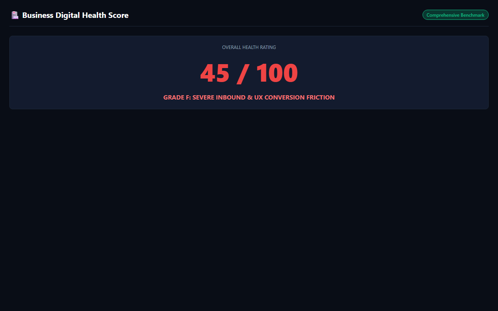

# Business Digital Health & Friction Auditor

[](https://gideonbawa-website.netlify.app/simulators/business-digital-health-score/)
[-success?style=for-the-badge)](test/business-digital-health-score.test.js)
[](src/index.js)

> **Commercial Value:** $5,000 – $15,000 implementation fee  
> **Primary Buyer:** Founders, CEOs, Operations Leads, Agency Partners, E-commerce Directors

---

## ⚡ Live Sandbox Preview



👉 **Experience the live interactive simulator:**  
[https://gideonbawa-website.netlify.app/simulators/business-digital-health-score/](https://gideonbawa-website.netlify.app/simulators/business-digital-health-score/)

---

## 🎯 Commercial Problem & ROI

Automated multi-engine auditor that benchmarks small-to-medium businesses across mobile UX, response latency, conversion friction, and SEO, generating an executive 0-100 score.

### Why Existing Solutions Fail
1. **Manual Inefficiency:** Critical signals get lost in disconnected tools and email threads.
2. **Delayed Intervention:** By the time executives realize the problem, clients have churned or money has leaked.
3. **Lack of Auditability:** No single tamper-proof log tracks commitments and agreements.

---

## 🛠️ Architecture & Under-the-Hood Engineering

- **Zero-Dependency Engine:** High-performance pure Node.js runtime with zero external runtime packages.
- **Deterministic State Modeling:** Clean transitions and audit trails for maximum business reliability.
- **Interactive Dark-Mode HUD:** Live client-facing simulation sandbox for instant stakeholder signoff.

---

## 🧪 Verification & Automated Testing

```bash
npm test
```
